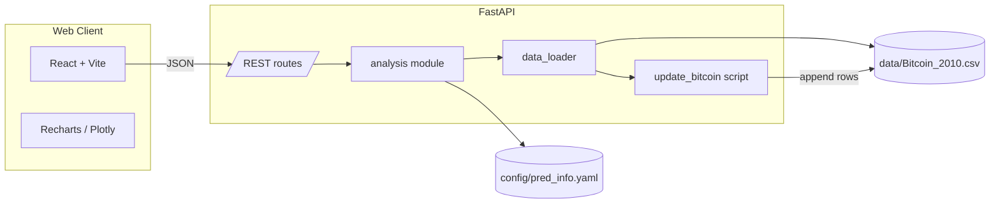

# Conditional Probability Dashboard — Product Specification

**Project:** `cond_prob_website`  
**Product name:** Conditional Probability with Moving Averages on Bitcoin (**CPMAB**)  
**Status:** Draft v1 (decisions locked below)  
**Source analysis:** `Bitcoin_mstr/conditional_probability/pred_info/`  
**Reference report:** `pred_info_20240115.pdf`

---

## 1. Purpose

Interactive web dashboard for Bitcoin conditional-probability (CP) analysis. Replaces static PDF reports with a React UI backed by a Python API that reuses the existing `pred_info` math.

Users pick an analysis date and strategy parameters (H, T, k wiggle), see headline CP, inspect **every historical analog day** that enters the probability calculation, and explore sweeps, heatmaps, and ranked long/short strategies—with drill-down into individual strategy outcomes.

---

## 2. Goals

| Goal | Detail |
|------|--------|
| Parity with PDF | Reproduce all six PDF page groups as live charts and tables |
| Transparency | Show analog dates (k-match set) on a price chart; hits vs misses visible |
| Customization | User controls analysis date, H, T, k wiggle; sensible defaults |
| Strategy inspection | Expand any ranked strategy to see full analog history and outcomes |
| Self-contained repo | Standalone deploy; bundled CSV + incremental updater |
| Fast iteration | Monorepo: FastAPI API + React (Vite) frontend |

## 3. Non-goals (v1)

- User accounts / authentication
- Saving or sharing custom views (URL query params only)
- Real-time streaming prices
- Shorting/longing execution or financial advice disclaimers beyond a static footer
- Rewriting analysis in JavaScript

---

## 4. Architecture



### 4.1 Stack

| Layer | Choice | Rationale |
|-------|--------|-----------|
| Frontend | **React 18 + Vite + TypeScript** | Simple SPA, fast dev, easy Vercel deploy |
| Charts | **Plotly.js** (`react-plotly.js`) | Heatmaps, log-x k-wiggle axis, rich hover |
| UI primitives | Tailwind + shadcn/ui (optional) | Tables, dialogs, date picker |
| Backend | **FastAPI + Python 3.11+** | Reuse pandas/numpy analysis unchanged |
| Data | `Bitcoin_2010.csv` (MM/DD/YYYY, Price) | Same format as parent repo |
| Config | `pred_info.yaml` | Grid lists, k sweep bounds, filter defaults |

### 4.2 Repository layout

```
cond_prob_website/
├── SPEC.md
├── README.md
├── .gitignore
├── docker-compose.yml          # local: api + web
├── data/
│   └── Bitcoin_2010.csv        # copied from Bitcoin_mstr; appended by updater
├── config/
│   └── pred_info.yaml          # grid + sweep settings (from pred_info)
├── api/
│   ├── pyproject.toml
│   ├── main.py                 # FastAPI app, CORS, routes
│   ├── analysis.py             # copied from pred_info; extended (see §6)
│   ├── data_loader.py          # load CSV + stale check → run updater
│   ├── serializers.py          # StrategyResult → JSON
│   ├── scripts/
│   │   └── update_bitcoin.py   # adapted from Bitcoin_mstr/scripts/
│   └── tests/
│       └── test_analysis.py    # golden values vs known PDF date
└── web/
    ├── package.json
    ├── vite.config.ts
    ├── src/
    │   ├── App.tsx
    │   ├── api/client.ts
    │   ├── components/
    │   │   ├── ControlPanel.tsx
    │   │   ├── PriceContextChart.tsx
    │   │   ├── AnalogEventsChart.tsx    # NEW — core differentiator
    │   │   ├── CpVsTChart.tsx
    │   │   ├── CpVsHChart.tsx
    │   │   ├── KWiggleChart.tsx
    │   │   ├── CpHeatmap.tsx
    │   │   ├── StrategyTable.tsx
    │   │   └── StrategyInspector.tsx    # drill-down modal
    │   ├── hooks/useAnalysis.ts
    │   └── types/analysis.ts
    └── public/
```

---

## 5. Data layer

### 5.1 CSV format

Same as parent project:

```csv
Date,Price
07/18/2010,0.1
...
06/10/2026,98500.00
```

- **Date:** `MM/DD/YYYY`
- **Price:** USD, no commas in file

Initial copy: `Bitcoin_mstr/data/Bitcoin_2010.csv` → `cond_prob_website/data/Bitcoin_2010.csv`.

### 5.2 Incremental update (`api/scripts/update_bitcoin.py`)

Port of `Bitcoin_mstr/scripts/update_bitcoin.py`:

1. Read last date from CSV tail (efficient byte seek).
2. Fetch `(last_date + 1)` … `today` from CoinGecko `market_chart/range`.
3. Chunk requests (300-day windows); respect public API 365-day lookback rules.
4. Append new rows only; ensure trailing newline.

**When to run:**

| Trigger | Behavior |
|---------|----------|
| API startup | If CSV mtime &gt; 8 hours old, run updater (same cadence as `pred_info/data_loader.py`) |
| `POST /api/data/refresh` | Manual refresh; returns rows added |
| GitHub Action (optional) | Weekly cron commits CSV updates for static fallback |

### 5.3 Date resolution

If user picks a non-trading day, resolve to **nearest prior trading day** in CSV (same as `resolve_analysis_date`).

---

## 6. Analysis model

### 6.1 Core definitions (unchanged from `pred_info`)

For analysis date \(d\), horizon **H**, forward window **T**, k wiggle \(\pm k\):

- \( \text{MA}_H(t) \) = H-day rolling mean of price  
- \( k(t) = \text{Price}(t) / \text{MA}_H(t) \)  
- **Side** at \(d\): price &lt; MA → **long**; price &gt; MA → **short**; equal → neutral (no analysis)

**Analog day** \(t < d\) qualifies when:

1. \( |k(t) - k(d)| \le k\_\text{wiggle} \)
2. Same side rule: long → price &lt; MA; short → price &gt; MA  
3. Forward price at \(t + T\) exists in dataset

**Hit:**

- Long: \(\text{Price}(t+T) > \text{Price}(t)\)
- Short: \(\text{Price}(t+T) < \text{Price}(t)\)

\[
\text{CP} = \frac{\text{hits}}{\text{occurrences}}
\]

### 6.2 User-facing parameters

| Parameter | Control | Default | Notes |
|-----------|---------|---------|-------|
| `analysis_date` | Date picker | **Today** (or latest CSV date if today missing) | Resolved to trading day |
| `H` | Number input / slider | **200** | Days; MA lookback for primary view |
| `T` | Number input / slider | **90** | Days; forward horizon for primary view |
| `k_wiggle` | Slider | **0.01** | ± band on k ratio |
| `min_occurrences` | Advanced | `0` (from yaml) | Filter for rankings |
| `top_n` | Advanced | `10` | Rows in strategy tables |

**Primary pair (H, T)** drives:

- Headline CP stat card  
- **Analog events chart** (§7.2)  
- Highlight marker on heatmap  

**Grid lists** from `pred_info.yaml` drive heatmap axes and full strategy grid (same as PDF).

### 6.3 New backend functions (extensions to `analysis.py`)

```python
@dataclass(frozen=True)
class AnalogEvent:
    date: str              # ISO date of analog day
    price: float
    ma: float
    k: float
    future_date: str       # date + T calendar days (resolved to trading day in series)
    future_price: float
    hit: bool
    return_pct: float      # (future - entry) / entry * 100; sign meaningful for side

def compute_analog_events(
    df, analysis_date, H, T, k_wiggle
) -> tuple[StrategyResult | None, list[AnalogEvent]]:
    """Return aggregate result plus every analog row for charts / inspector."""
```

Existing functions retained: `compute_cp_at`, `compute_strategy_grid`, `rank_strategies`, `top_unique_from_ranked`, `results_to_dataframe`.

---

## 7. API contract

Base URL: `/api`  
All responses JSON. Errors: `{ "detail": "..." }` with appropriate HTTP status.

### 7.1 `GET /api/meta`

Returns dataset bounds and defaults.

```json
{
  "date_min": "2010-07-18",
  "date_max": "2026-06-10",
  "defaults": { "H": 200, "T": 90, "k_wiggle": 0.01 },
  "grid": { "H_days": [...], "T_days": [...] },
  "k_wiggle_sweep": { "min": 0.001, "max": 0.15, "points": 80 }
}
```

### 7.2 `GET /api/analyze`

Main payload for dashboard. Query params:

| Param | Required | Default |
|-------|----------|---------|
| `date` | no | latest CSV date |
| `H` | no | 200 |
| `T` | no | 90 |
| `k_wiggle` | no | 0.01 |
| `min_occurrences` | no | 0 |
| `top_n` | no | 10 |

Response structure:

```json
{
  "analysis_date": "2024-01-15",
  "resolved_date": "2024-01-15",
  "side": "long",
  "k_today": 0.9823,
  "relation": "below",
  "price_today": 42500.0,
  "primary": {
    "H": 200,
    "T": 90,
    "cp": 0.64,
    "hits": 32,
    "occurrences": 50,
    "forward_resolved": true
  },
  "price_context": {
    "series": [
      { "date": "2023-06-01", "price": 27000, "ma_200": 26500 }
    ],
    "ma_windows": [200]
  },
  "analog_events": [
    {
      "date": "2022-03-10",
      "price": 39000,
      "ma": 42000,
      "k": 0.981,
      "future_date": "2022-06-08",
      "future_price": 41000,
      "hit": true,
      "return_pct": 5.13
    }
  ],
  "cp_vs_T": {
    "curves": [
      { "H": 200, "label": "H=200 (primary)", "points": [{ "T": 50, "cp": 0.58, "n": 45 }] }
    ],
    "T_range": [50, 1095]
  },
  "cp_vs_H": {
    "curves": [
      { "T": 90, "label": "T=90 (primary)", "points": [{ "H": 150, "cp": 0.61, "n": 40 }] }
    ],
    "H_range": [50, 1000]
  },
  "k_wiggle_sweep": {
    "long": [{ "H": 200, "T": 90, "points": [{ "k": 0.01, "cp": 0.64, "n": 50 }] }],
    "short": [...]
  },
  "heatmap": {
    "H_values": [...],
    "T_values": [...],
    "long": [[0.64, null, ...]],
    "short": [[...]],
    "occurrences": [[50, ...]],
    "highlight": { "H": 200, "T": 90 }
  },
  "top_long": [...StrategyResult...],
  "top_short": [...StrategyResult...]
}
```

**CP vs T / CP vs H curve selection (PDF parity + primary highlight):**

- Always include curve for user's **primary H** (CP vs T) and **primary T** (CP vs H), styled prominently.
- Add up to 4 additional curves using `top_unique_from_ranked` on full grid (same as PDF pages 2–3).
- Sweep ranges: `T` from `min(T_days)` to `max(T_days)` step 1; `H` from `min(H_days)` to `max(H_days)` step 1.

**K-wiggle sweep:**

- Top 5 long and top 5 short from ranked grid (slice_top_n = 5 from yaml).
- Always include primary (H, T) if not already in top 5.
- k values: `logspace` 80 points from yaml min/max.

### 7.3 `GET /api/strategy/detail`

Drill-down for strategy inspector.

Query: `date`, `H`, `T`, `k_wiggle`, `side` (optional; inferred from date if omitted)

Returns: full `AnalogEvent[]`, summary `StrategyResult`, and optional `forward_unresolved` flag if analysis_date + T beyond data.

### 7.4 `POST /api/data/refresh`

Runs updater; returns `{ "rows_added": N, "date_max": "..." }`.

### 7.5 Caching

- In-memory LRU keyed by `(date, H, T, k_wiggle, min_occurrences, top_n)` for `/api/analyze` (TTL 1 hour).
- `/api/strategy/detail` cache keyed by `(date, H, T, k_wiggle)`.

---

## 8. UI specification

### 8.1 Layout

Single-page dashboard with sticky **control panel** at top; sections scroll below.

```
┌─────────────────────────────────────────────────────────────┐
│  Conditional Probability Dashboard                        │
│  [Date ▼] [H: 200] [T: 90] [k ±0.01 ───●───] [Analyze]   │
│  Side: LONG · k=0.98 · CP 64% (32/50) · BTC $42,500        │
└─────────────────────────────────────────────────────────────┘
│ § Price context + analog events (combined or stacked)      │
│ § CP vs T  |  CP vs H                                      │
│ § K wiggle (long) | K wiggle (short)                       │
│ § Heatmap long | Heatmap short                             │
│ § Top long strategies | Top short strategies               │
└─────────────────────────────────────────────────────────────┘
```

**Responsive:** Control panel wraps; charts stack single-column on mobile; heatmaps scroll horizontally.

### 8.2 Section details

#### A. Control panel

- Date picker constrained to `[date_min, date_max]`.
- H, T: integer inputs 1–2000 with validation.
- k wiggle: slider 0.001–0.15 (log scale optional on slider).
- **Analyze** button debounced; auto-run on param change after 400 ms (optional toggle "Auto-update").
- Summary strip: side badge (green long / red short), k_today, CP, hits/occurrences, spot price.

#### B. Price context + analog events (PDF page 1 + NEW)

**Two-panel or overlay chart:**

1. **Price context** (PDF parity): BTC price line; **default: MA(primary H) only**; toggle **"Show all MAs"** overlays all H values from config grid (PDF parity). Vertical line at analysis date; spot price annotation. Window: `[analysis_date - 3×max(H_grid), analysis_date]`.

2. **Analog events** (NEW — required):

   - Same price window or full history toggle.
   - Scatter/markers on **each analog date** for primary (H, T, k):
     - **Green** = hit (success)
     - **Red** = miss
     - **Gray** = analog but used in denominator only (same color as miss; legend clarifies)
   - Hover tooltip: date, price, k, MA, future date/price, return %, Hit/Miss.
   - Toggle filters: All analogs | Hits only | Misses only.
   - Optional vertical segments from entry to exit date at entry price (light lines) when "Show forward paths" enabled.

This chart answers: *"Which past days matched today's k and side, and did T-day forward move succeed?"*

#### C. CP vs T (PDF page 2 top)

- Line chart: x = T (days), y = CP (%), 0–100.
- Primary curve H=user H (bold).
- Secondary curves: top unique H from grid ranking (muted).
- Hover: CP, n.

#### D. CP vs H (PDF page 2 bottom)

- Line chart: x = H, y = CP (%).
- Primary curve T=user T (bold).
- Secondary: top unique T from ranking.

#### E. K wiggle sensitivity (PDF page 3)

- Two charts side-by-side: Top long strategies | Top short strategies.
- x = k wiggle (log scale, inverted x per PDF convention).
- y = CP (%).
- One line per strategy; primary (H,T) labeled if present.

#### F. Heatmaps (PDF page 4)

- Two heatmaps: Long CP | Short CP.
- x = T_days from config, y = H_days from config.
- Cell color: CP 0–1 (RdYlGn).
- Cell annotation: `CP%` and `(n=…)` when n ≥ min_occurrences; else show n only or blank.
- **Highlight border** on cell (H_user, T_user).

#### G. Strategy tables (PDF pages 5–6)

Columns: H | T | k | Relation | Hits | n | CP

- Tabs or side-by-side: **Top long** | **Top short**
- Row click → open **Strategy inspector** (§8.3).
- Bar chart beside or below table (horizontal bars, CP %) — PDF parity.

### 8.3 Strategy inspector (modal / drawer)

Triggered from table row or heatmap cell click.

**Header:** `Long · H=200 · T=90 · CP 64% (32/50) · k±0.01`

**Content:**

1. Mini analog chart (same hit/miss markers, zoomed to analog dates).
2. Sortable table of all analog events:

   | Date | Price | MA(H) | k | Exit date | Exit price | Return % | Outcome |

3. Summary stats: mean return on hits, mean on misses, max/min return.
4. Export CSV button for this strategy's analog list.

If `forward_resolved` is false for analysis date itself, show banner: *"Forward window extends beyond latest data; CP for today is historical analogs only."*

### 8.4 Empty / error states

| Condition | UI |
|-----------|-----|
| Neutral side (price = MA) | Block analysis; message to pick another date or H |
| Zero occurrences | Show CP 0%; analog chart empty with explanation |
| API error | Toast + retry |
| Data refresh in progress | Spinner on date max badge |

### 8.5 Visual design notes

- Dark-friendly neutral palette; long = green accents, short = red accents (match PDF bar colors `#2ca02c` / `#d62728`).
- Chart titles match PDF wording where applicable.
- Footer: *"Historical analog analysis only. Not financial advice."*

---

## 9. Mapping: PDF → web sections

| PDF page | Web section | Parity notes |
|----------|-------------|--------------|
| 1 — Price context | §8.2B top panel | MA lines for config H list (top 10) or primary H only in compact mode |
| — | §8.2B analog overlay | **New**; not in PDF |
| 2 — CP vs T / CP vs H | §8.2C, §8.2D | Same sweep logic; primary H/T highlighted |
| 3 — K wiggle long/short | §8.2E | Log-x inverted |
| 4 — Heatmaps | §8.2F | Same H/T grid from yaml |
| 5 — Top long table + bars | §8.2G | + row drill-down |
| 6 — Top short table + bars | §8.2G | + row drill-down |

---

## 10. Files copied from `Bitcoin_mstr`

| Source | Destination | Changes |
|--------|-------------|---------|
| `conditional_probability/pred_info/analysis.py` | `api/analysis.py` | Add `AnalogEvent`, `compute_analog_events` |
| `conditional_probability/pred_info/data_loader.py` | `api/data_loader.py` | Paths → local `data/`; updater script path |
| `conditional_probability/pred_info/config/pred_info.yaml` | `config/pred_info.yaml` | Unchanged |
| `data/Bitcoin_2010.csv` | `data/Bitcoin_2010.csv` | Initial seed |
| `scripts/update_bitcoin.py` | `api/scripts/update_bitcoin.py` | CSV path → `../../data/Bitcoin_2010.csv` |

`report.py` is **not** copied; charts are implemented in React only. Its drawing logic informs API series shape and UI behavior.

---

## 11. Deployment

### 11.1 Environments

| Env | Frontend | API |
|-----|----------|-----|
| Local | `npm run dev` → :5173 | `uvicorn main:app` → :8000 |
| Production | Vercel | Railway or Render |

`VITE_API_URL` points to production API; FastAPI CORS allows frontend origin.

### 11.2 Docker (local optional)

```yaml
services:
  api:
    build: ./api
    volumes: ["./data:/app/data"]
    ports: ["8000:8000"]
  web:
    build: ./web
    environment:
      VITE_API_URL: http://localhost:8000
    ports: ["5173:5173"]
```

### 11.3 CI (GitHub Actions)

1. **test.yml** — pytest on API; `npm test` / typecheck on web.
2. **data-refresh.yml** (weekly) — run updater, commit CSV if changed.

---

## 12. Implementation phases

### Phase 1 — Foundation
- [ ] Init git repo in `cond_prob_website`
- [ ] Copy data, config, analysis, updater
- [ ] Implement `compute_analog_events`
- [ ] FastAPI `/meta`, `/analyze`, `/strategy/detail`
- [ ] pytest golden test for `2024-01-15`, H=200, T=90

### Phase 2 — Core UI
- [ ] Vite + React scaffold, API client, types
- [ ] Control panel + summary strip
- [ ] Analog events chart + price context
- [ ] CP vs T, CP vs H, k wiggle, heatmaps

### Phase 3 — Tables & inspector
- [ ] Strategy tables + bar charts
- [ ] Strategy inspector modal with export

### Phase 4 — Deploy & polish
- [ ] Caching, loading states, URL query sync (`?date=2024-01-15&H=200&T=90`)
- [ ] Vercel + Railway deploy
- [ ] README runbook

---

## 13. Acceptance criteria

1. Defaults load as **today** (or latest data date), **H=200**, **T=90**, **k=0.01**.
2. Analog chart shows every qualifying historical day with hit/miss coloring; hover shows forward outcome.
3. All PDF chart types render with data consistent with `run_pred_info.py` for same date/config grid.
4. Clicking a top strategy opens inspector with full analog list matching CP hit count.
5. CSV auto-refreshes when stale on API start; manual refresh endpoint works.
6. Site runs from standalone repo without importing `Bitcoin_mstr` at runtime.

---

## 14. Resolved decisions

| Topic | Decision |
|-------|----------|
| Product name | **CPMAB** — Conditional Probability with Moving Averages on Bitcoin |
| Price chart MAs | Primary H only by default; **toggle** to show all config H MAs |
| GitHub repo | User creates public repo separately; local folder stays `cond_prob_website` |
| Mobile layout | CP vs T and CP vs H **stacked** (separate charts) |
| H / T units | **Trading days** (CSV rows), same as `pred_info` — not calendar days |
| Auth | Public site, no login (v1) |
| Auto-update params | **On by default** — debounced re-fetch when date/H/T/k change |

## 15. Remaining open items (non-blocking)

These have sensible build defaults; confirm only if you care:

1. **Deploy timing** — build + run locally through Phase 3 first, deploy (Vercel + Railway) in Phase 4 unless you want deploy earlier.
2. **UI theme** — default light with optional dark mode toggle, or dark-first?
3. **`min_occurrences` filter** — keep hidden in "Advanced" with default `0`, or expose in main control panel?

---

*End of SPEC v1*
